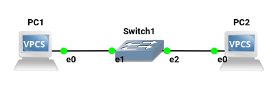
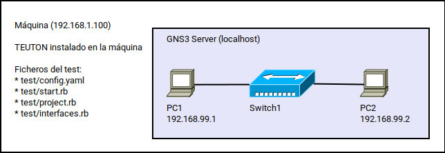
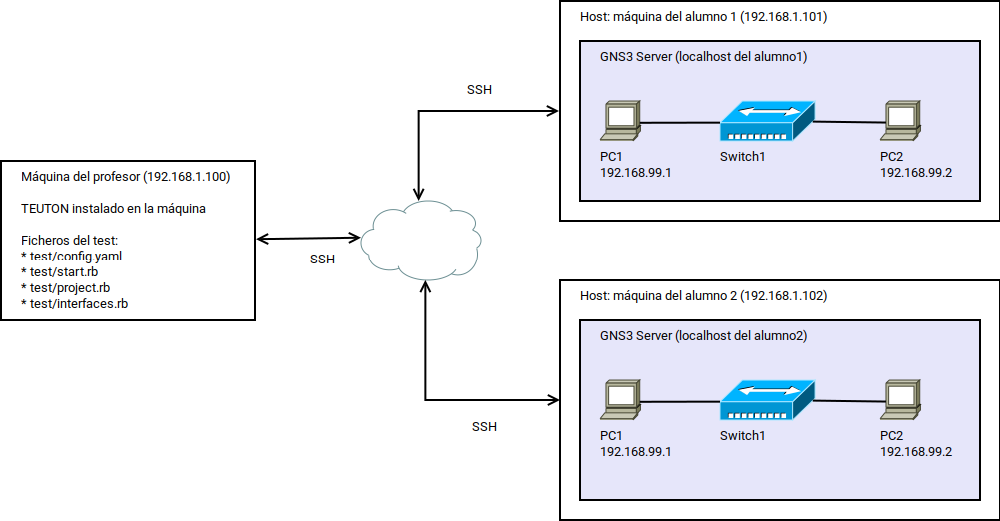

# Laboratorio 01 - GNS3 con Teuton

Enlaces de interés:
* [Introducción a Teuton](https://elpuig.xeill.net/Members/vcarceler/articulos/introduccion-a-teuton): iniciarse en el uso de Teutón gracias al fantástico artículo de Víctor Carceler.
* [Verificar prácticas de GNS3 con Teuton](https://elpuig.xeill.net/Members/juanmorote/articulos/verificar-practicas-de-gns3-con-teuton): GNS3 es un excelente simulador de red Open Source que además se entiende con Teuton a las mil maravillas.

## 0. Enunciado

El alumno debe crear un proyecto GNS3 según el siguiente esquema:



* El fichero del proyecto debe estar en la ruta `project/lab.gns3`.
* Crear un VPCS con el nombre `PC1` y la IP `192.168.99.1`.
* Crear un VPCS con el nombre `PC2` y la IP `192.168.99.2`.
* Crear un switch con el nombre `Switch1`.
* Conectar los dispositivos según el esquema anterior.

> Recordar que hay que grabar las configuraciones.

## 1. Situación: Ejecución en localhost

Instalación por defecto de GNS3 en una única máquina.



Vamos a suponer que tenemos el siguiente entorno:
* Tenemos una máquina que tiene instalado Teuton y el GNS3.
* El GNS3 Server está configurado para escuchar en la IP localhost.
* En el Host deben estar los comandos `jq`, `curl` y el fichero del proyecto GNS3

Esta situación es útil en:
* Un profesor está desarrollando y probando la actividad en local.
* Un alumno está trabajando la actividad y usa los test para autoevaluar su progreso.

> Se han creado varias versiones del mismo test de Teuton, donde cada versión incluye una pequeña mejora con respecto de la versión anterior.

### 1.1 Test: Primera versión

[Consultar el test_v1](test_v1)

El test tiene los `targets` definidos en dos ficheros.

* Fichero `project.rb`:
  * Se definen `targets` que leen el contenido del proyecto GNS3 (`project/lab.gns3`). 
  * Se hacen consultas al proyecto GNS3 para crear nuevos parámetros con los valores de los puerto correspondientes a la consola de cada dispositivo VPCS.
  * Vemos como se usa el comando `jq` para leer el contenido JSON del fichero del proyecto GNS3.
* Fichero `interfaces.rb`:
  * Se definen `targets` que "inyectan" comandos en la consola de cada dispositivo VPCS del simulador y valoran su salida.
  * Se usan los comandos `echo` y `curl` para "inyectar" comandos en IP:Port correspondiente a la consola de cada dispositivo.
  * Es necesario que el GNS3 server esté en ejecución y los dispositivos activados.

### 1.2 Test: Cambiando tareas repetitivas por bucles (Iteradores)

[Consultar el test_v2](test_v2)

Este test es una copia del anterior pero se han realizado algunas mejoras.

* Del fichero de configuración se han eliminado los parámetro `project_file` y `project_dir`, porque se pueden extraer del parámetro `project_path`. Esto lo podemos ver en las líneas 3-9 del fichero `project.rb`.
* En el fichero `project.rb` se han sustituido algunas tareas repetitivas por un bucle (iterador) como podemos ver en las líneas 16-23 y 29-36.
* En el fichero `interfaces.rb` se añaden varias instrucciones `readme` que nos ayudarán a la construcción de un fichero Markdown con el enunciado. Esto lo podemos ver en la líneas 2-4 y 23-25.

Para construir un enunciado a partir del test hacemos:

```bash
teuton readme test_v2 > test2/README.md
```

Podemos consultar el resultado en el fichero [test_v2/README.md](test2/README.md).

### 1.3 Test: Conexiones vía Telnet

[Consultar el test_v3](test_v3)

**Crear conexiones Telnet**

En los ejemplos anteriores, dentro del fichero `interfaces`, se lanzaban algunos comandos desde la máquina local para "inyectar" comandos a un servidor Telnet. 

Por ejemplo, el código siguiente:
```ruby
  cmd1 = "show ip"
  cmd2 = "echo \"#{cmd1}\" | curl -m 1 telnet://#{get(:gns3server_ip)}:#{console}"
  run cmd2, on: :host
```
Esto da como resultado la ejecución del comando `echo "show ip" | curl -m 1 telnet://localhost:5002`

Esta forma de "conectar" con el servicio Telnet para acceder dentro de los disposivos simulados e GNS3 funciona perfectamente, pero también podemos aprovechar que Teuton puede realizar conexiones SSH y Telnet a equipos remotos para reescribir las instrucciones del test de la siguiente forma:

```ruby
  run "show ip", on: :vpc1
```

Esta otra forma es más corta y puede ser más sencilla de entender. Esto es, ejecutar el comando `show ip` en la máquina remota `vpc1`. Ahora bien, es necesario definir para `vcp1` su IP, puerto y protocolo. Estos valores lo podemos definir dentro de `config.yaml` o con instrucciones dentro del test. Esto lo podemos ver en las líneas 30-42 del fichero `project.rb`.

**Mejorar la legibilidad**

En el fichero `interfaxces.rb` tenemos varios target como el siguiente:

```ruby
  target "Configurar pc1 ip <#{_pc1_ip}>"
  run "show ip", on: :vpc1
  expect_one ["IP/MASK", _pc1_ip]
```

Aquí tenemos dos cosas nuevas. Por un lado, la instrucción `get(:pc1_ip)` se puede reescribir como `_pc1_ip`. Ambas instrucciones son idénticas. Pero en algunos casos puede resultar más claro usar una u otra. Por tanto cualquier instrucción como `_name` es un alias a `get(:name)`.

Y otra cosa nueva es la instrucción `expect_one [A, B, C]`. Esta instrucción espera encontrar en la salida del comando anterior una única línea con los textos A, B y C en la misma línea.

Otra forma de construir el `expect` para encontrar lo que buscamos sería usando expresiones regulares. 

> Más información sobre [expect](https://github.com/teuton-software/teuton/blob/master/docs/dsl/expect.md)

## 2. Situación: Ejecución en una red de máquinas

Instalación por defecto de GNS3 en varias máquinas con acceso SSH desde el exterior.



Vamos a suponer que tenemos el siguiente entorno:
* Cada alumno tiene su propia máquina, donde tiene instalado el GNS3.
* El GNS3 Server está configurado para escuchar en la IP localhost.
* Cada alumno tiene instalado el servicio SSH en su máquina (Host).
* El profesor debe tener acceso SSH a cada máquina de los alumnos.
* En cada Host deben estar los comandos `jq` y `curl`.

Esta situación es útil para:
* Un profesor desea evaluar el trabajo que están desarrollando los alumnos en sus máquinas.

> Se han creado varias versiones del mismo test de Teuton, donde cada versión incluye una pequeña mejora con respecto de la versión anterior.

### 2.1 Test: Primera versión

Se usa el mismo código de [test_v1](test_v1), pero en este caso se modifica el fichero `test_v1/config.yaml` de la siguiente forma:
* Se añaden las configuraciones de los diferentes alumnos (`cases`).
* Los parámetros que se repiten de cada `case` se ponen en la sección `global`.
* Cada alumno tiene una IP diferente en su Host.

```yaml
---
global:
  project_file: lab.gns3
  project_dir: project
  project_path: project/lab.gns3
  gns3server_ip: localhost
  pc1_ip: 192.168.99.1
  pc2_ip: 192.168.99.2
cases:
- tt_members: Student1
  host_ip: 192.168.1.1
- tt_members: Student2
  host_ip: 192.168.1.2
```

### 2.2 Test: Cambiando tareas repetitivas por bucles (Iteradores)

Se usa el mismo código de [test_v2](test_v2), pero en este caso se añaden en el fichero `test_v2/config.yaml`, las configuraciones de cada uno de los alumnos (`cases`).

### 2.3 Test: Conexiones vía Telnet

Se usa el mismo código de [test_v3](test_v3), pero en este caso se añaden en el fichero `test_v3/config.yaml`, las configuraciones de cada uno de los alumnos (`cases`).

## 3. Situación: incorporamos un nodo Cloud

EN DESARROLLO!
